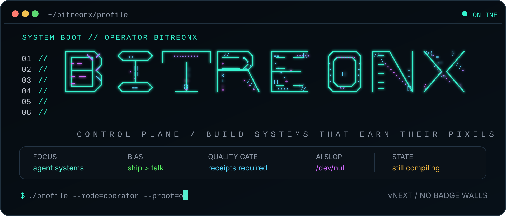
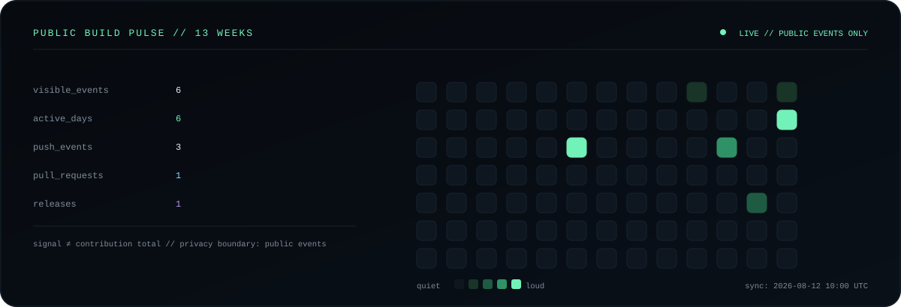

<!--
  bitreonx / control plane
  source is intentionally readable.
  no badge wall. no visitor counter. no fake telemetry.
-->

<p align="center">
  
</p>

<p align="center">
  <code>agent systems</code>&nbsp;&nbsp;·&nbsp;&nbsp;
  <code>developer tooling</code>&nbsp;&nbsp;·&nbsp;&nbsp;
  <code>product craft</code>&nbsp;&nbsp;·&nbsp;&nbsp;
  <code>open-source experiments</code>
</p>

```console
bitreonx@github:~$ whoami
builder by default.
systems thinker when the problem earns it.
I turn "what if..." into running software.
```

<table>
<tr>
<td width="220" align="center" valign="middle">

<a href="https://github.com/bitreonx">
  
</a>

<sub><code>@bitreonx</code></sub>

</td>
<td valign="middle">



</td>
</tr>
</table>

### `ps aux | grep obsession`

```text
PID   PROCESS                    MODE         NOTE
017   agent-systems              building     specialists > fake generalists
042   product-craft              obsessive    pixels need a reason
108   dev-tooling                recursive    remove friction, don't decorate it
404   boring-software            killed       exit code: intentional
```

<p align="center">
  
</p>

<sub>
The signal is generated inside this repo from GitHub's <b>public events</b> endpoint.
It is not a visitor counter, not a private contribution leak, and not a GitHub contribution-total clone.
</sub>

<br /><br />

<details open>
<summary><code>cat /proc/bitreonx/build_rules</code></summary>
<br />

```toml
[defaults]
ship_over_talk = true
proof_over_claims = true
abstraction_budget = "earned"
ai_slop = "/dev/null"
dead_buttons = "segfault"

[design]
demonstrate_before_describing = true
repetition_requires_reason = true
motion_requires_purpose = true

[engineering]
boring_when_boring_is_better = true
clever_when_clever_earns_it = true
receipts_required = true
```
</details>

<details>
<summary><code>cat /proc/bitreonx/current_obsessions</code></summary>
<br />

```text
01  agent teams that coordinate instead of cosplay teamwork
02  developer tools that collapse cognitive overhead
03  interfaces where every pixel can explain why it exists
04  durable context for agents working across real codebases
05  experiments shipped before the idea gets comfortable
```
</details>

<details>
<summary><code>tree ~/brain --depth=2</code></summary>
<br />

```text
~/brain
├── agent-systems/
│   ├── orchestration
│   ├── memory
│   └── verification
├── product/
│   ├── interaction
│   ├── performance
│   └── evidence
├── devtools/
│   ├── automation
│   └── weird-useful-things
└── currently-compiling/
    └── ...
```
</details>

<details>
<summary><code>sudo rm -rf /boring</code></summary>
<br />

```text
permission granted.

removed:
  streak-card.svg
  visitor-counter.gif
  rainbow-badge-wall/
  passionate-developer-boilerplate.md

the repo is the résumé.
the commits are the footnotes.
```
</details>

<details>
<summary><code>./open-ports --public</code></summary>
<br />

**profile** → [github.com/bitreonx](https://github.com/bitreonx)  
**repos** → [github.com/bitreonx?tab=repositories](https://github.com/bitreonx?tab=repositories)  
**stars** → [github.com/bitreonx?tab=stars](https://github.com/bitreonx?tab=stars)
</details>

<br />

<p align="center">
  
</p>

<!-- eof / still compiling -->
