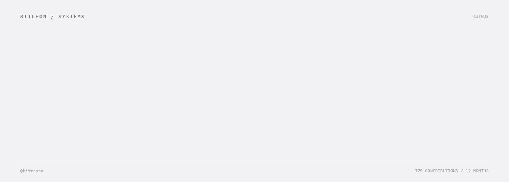
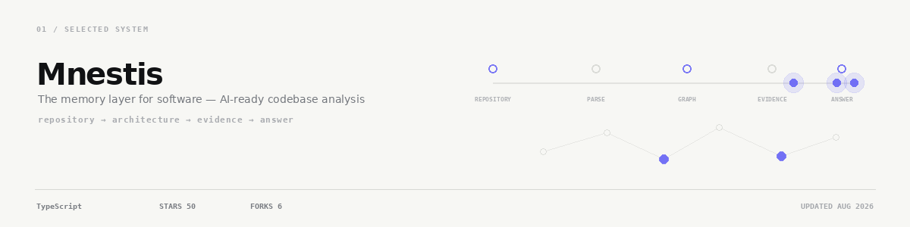
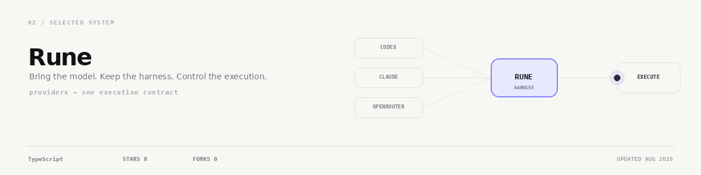
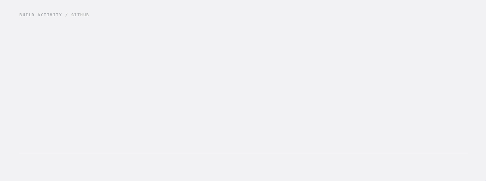

<!-- Generated from profile.json + live GitHub data. Edit profile.json, not README.md. -->

<picture>
  <source media="(prefers-reduced-motion: reduce) and (prefers-color-scheme: dark)" srcset="./assets/motion/hero-dark.png">
  <source media="(prefers-reduced-motion: reduce)" srcset="./assets/motion/hero-light.png">
  <source media="(prefers-color-scheme: dark)" srcset="./assets/motion/hero-dark.gif">
  <source media="(prefers-color-scheme: light)" srcset="./assets/motion/hero-light.gif">
  
</picture>

SELECTED SYSTEMS

<a href="https://github.com/bitreonx/Mnestis">
<picture>
  <source media="(prefers-color-scheme: dark)" srcset="./assets/motion/mnestis-dark.png">
  
</picture>
</a>

<a href="https://github.com/bitreonx/Rune">
<picture>
  <source media="(prefers-color-scheme: dark)" srcset="./assets/motion/rune-dark.png">
  
</picture>
</a>

BUILD ACTIVITY

<a href="https://github.com/bitreonx?tab=overview" title="Open the official interactive GitHub contribution graph">
<picture>
  <source media="(prefers-reduced-motion: reduce) and (prefers-color-scheme: dark)" srcset="./assets/motion/contributions-dark.png">
  <source media="(prefers-reduced-motion: reduce)" srcset="./assets/motion/contributions-light.png">
  <source media="(prefers-color-scheme: dark)" srcset="./assets/motion/contributions-dark.gif">
  <source media="(prefers-color-scheme: light)" srcset="./assets/motion/contributions-light.gif">
  
</picture>
</a>

<a href="https://github.com/bitreonx?tab=overview">Open the official interactive graph →</a>

<strong>Activity details</strong> · 181 exact contributions · Calendar through Sep 06, 2026

<strong>Best week</strong> 107 &nbsp;·&nbsp; <strong>Best month</strong> 116 / AUG 2026 &nbsp;·&nbsp; <strong>Active</strong> 28 days / 10 weeks

<a href="https://github.com/bitreonx?tab=overview&amp;from=2025-09-01&amp;to=2025-09-30"><code>SEP 2025 0</code></a> · <a href="https://github.com/bitreonx?tab=overview&amp;from=2025-10-01&amp;to=2025-10-31"><code>OCT 2025 0</code></a> · <a href="https://github.com/bitreonx?tab=overview&amp;from=2025-11-01&amp;to=2025-11-30"><code>NOV 2025 0</code></a> · <a href="https://github.com/bitreonx?tab=overview&amp;from=2025-12-01&amp;to=2025-12-31"><code>DEC 2025 0</code></a> · <a href="https://github.com/bitreonx?tab=overview&amp;from=2026-01-01&amp;to=2026-01-31"><code>JAN 2026 0</code></a> · <a href="https://github.com/bitreonx?tab=overview&amp;from=2026-02-01&amp;to=2026-02-28"><code>FEB 2026 0</code></a> · <a href="https://github.com/bitreonx?tab=overview&amp;from=2026-03-01&amp;to=2026-03-31"><code>MAR 2026 22</code></a> · <a href="https://github.com/bitreonx?tab=overview&amp;from=2026-04-01&amp;to=2026-04-30"><code>APR 2026 0</code></a> · <a href="https://github.com/bitreonx?tab=overview&amp;from=2026-05-01&amp;to=2026-05-31"><code>MAY 2026 0</code></a> · <a href="https://github.com/bitreonx?tab=overview&amp;from=2026-06-01&amp;to=2026-06-30"><code>JUN 2026 41</code></a> · <a href="https://github.com/bitreonx?tab=overview&amp;from=2026-07-01&amp;to=2026-07-31"><code>JUL 2026 0</code></a> · <a href="https://github.com/bitreonx?tab=overview&amp;from=2026-08-01&amp;to=2026-08-31"><code>AUG 2026 116</code></a> · <a href="https://github.com/bitreonx?tab=overview&amp;from=2026-09-01&amp;to=2026-09-06"><code>SEP 2026 2</code></a>

Source: GitHub GraphQL <code>contributionsCollection.contributionCalendar</code>. The refresh is rejected if the sum of daily counts differs from GitHub <code>totalContributions</code>.

CURRENTLY Building Mnestis and Rune — developer systems for code intelligence and agent execution.

ELSEWHERE 
<a href="https://github.com/bitreonx">GitHub</a> · <a href="https://github.com/bitreonx?tab=repositories">Repositories</a> · <a href="https://x.com/BitreonX">X</a> · <a href="https://www.youtube.com/@Bitreon">YouTube</a> · <a href="https://www.instagram.com/bitreonX">Instagram</a>

<!-- motion assets refresh automatically from GitHub data -->
