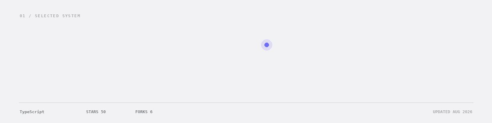
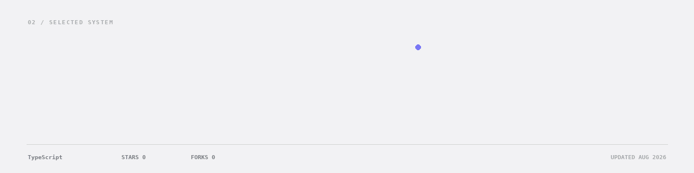

<!-- Generated from profile.json + live GitHub data. Edit profile.json, not README.md. -->

<picture>
  <source media="(prefers-reduced-motion: reduce) and (prefers-color-scheme: dark)" srcset="./assets/motion/hero-dark.png">
  <source media="(prefers-reduced-motion: reduce)" srcset="./assets/motion/hero-light.png">
  <source media="(prefers-color-scheme: dark)" srcset="./assets/motion/hero-dark.gif">
  <source media="(prefers-color-scheme: light)" srcset="./assets/motion/hero-light.gif">
  
</picture>

SELECTED SYSTEMS

<a href="https://github.com/bitreonx/Mnestis">
<picture>
  <source media="(prefers-reduced-motion: reduce) and (prefers-color-scheme: dark)" srcset="./assets/motion/mnestis-dark.png">
  <source media="(prefers-reduced-motion: reduce)" srcset="./assets/motion/mnestis-light.png">
  <source media="(prefers-color-scheme: dark)" srcset="./assets/motion/mnestis-dark.gif">
  <source media="(prefers-color-scheme: light)" srcset="./assets/motion/mnestis-light.gif">
  
</picture>
</a>

<a href="https://github.com/bitreonx/Rune">
<picture>
  <source media="(prefers-reduced-motion: reduce) and (prefers-color-scheme: dark)" srcset="./assets/motion/rune-dark.png">
  <source media="(prefers-reduced-motion: reduce)" srcset="./assets/motion/rune-light.png">
  <source media="(prefers-color-scheme: dark)" srcset="./assets/motion/rune-dark.gif">
  <source media="(prefers-color-scheme: light)" srcset="./assets/motion/rune-light.gif">
  
</picture>
</a>

BUILD ACTIVITY

<picture>
  <source media="(prefers-reduced-motion: reduce) and (prefers-color-scheme: dark)" srcset="./assets/motion/contributions-dark.png">
  <source media="(prefers-reduced-motion: reduce)" srcset="./assets/motion/contributions-light.png">
  <source media="(prefers-color-scheme: dark)" srcset="./assets/motion/contributions-dark.gif">
  <source media="(prefers-color-scheme: light)" srcset="./assets/motion/contributions-light.gif">
  
</picture>

DATA SOURCE <code>GitHub GraphQL → contributionsCollection.contributionCalendar</code> Every illuminated day comes from the exact contribution count returned for <code>@bitreonx</code>. No synthetic events.

CURRENTLY Building Mnestis and Rune — developer systems for code intelligence and agent execution.

ELSEWHERE 
<a href="https://github.com/bitreonx">GitHub</a> · <a href="https://github.com/bitreonx?tab=repositories">Repositories</a> · <a href="https://x.com/BitreonX">X</a> · <a href="https://www.youtube.com/@Bitreon">YouTube</a> · <a href="https://www.instagram.com/bitreonX">Instagram</a>

<!-- motion assets refresh automatically from GitHub data -->
