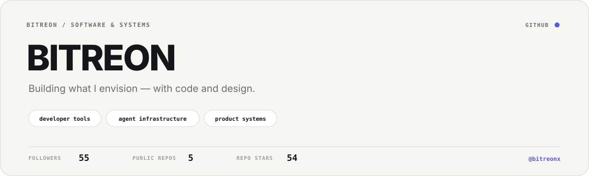
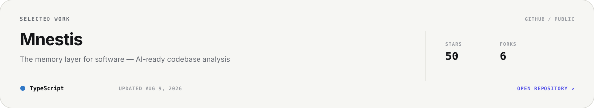
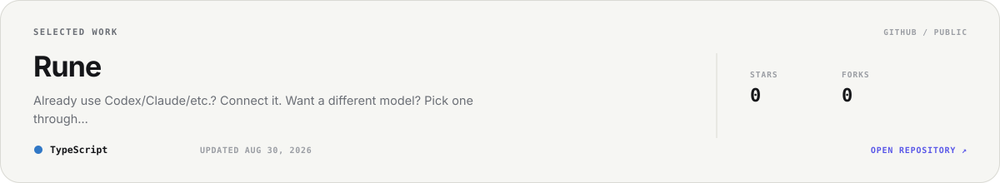
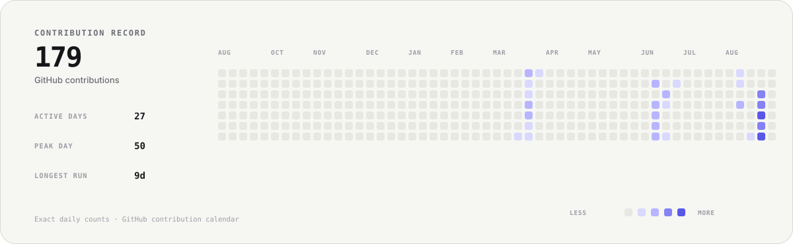

<!-- Generated from profile.json by scripts/render_profile.py. Edit profile.json, not this file. -->

<picture>
  <source media="(prefers-color-scheme: dark)" srcset="./assets/hero-dark.svg">
  <source media="(prefers-color-scheme: light)" srcset="./assets/hero-light.svg">
  
</picture>

I build developer tools and agent infrastructure with product-grade attention to evidence, interaction, and systems design.

## Selected work

<a href="https://github.com/bitreonx/Mnestis">
<picture>
  <source media="(prefers-color-scheme: dark)" srcset="./assets/project-mnestis-dark.svg">
  <source media="(prefers-color-scheme: light)" srcset="./assets/project-mnestis-light.svg">
  
</picture>
</a>

<a href="https://github.com/bitreonx/Rune">
<picture>
  <source media="(prefers-color-scheme: dark)" srcset="./assets/project-rune-dark.svg">
  <source media="(prefers-color-scheme: light)" srcset="./assets/project-rune-light.svg">
  
</picture>
</a>

## Contribution record

<picture>
  <source media="(prefers-color-scheme: dark)" srcset="./assets/contributions-dark.svg">
  <source media="(prefers-color-scheme: light)" srcset="./assets/contributions-light.svg">
  
</picture>

Generated from GitHub's own contribution calendar for <code>@bitreonx</code>. Every cell preserves the exact daily contribution count returned by GitHub; no event weighting or third-party stats service.

## How I build

- **Proof over claims.** Ship the artifact. Measure the behavior. Keep the receipt.
- **Complexity must earn itself.** Prefer the smallest system that preserves the important truth.
- **Interfaces are part of the system.** Clarity, latency and interaction quality are engineering constraints.
- **AI should increase rigor.** Use agents to widen exploration and verification, not to manufacture certainty.

## Elsewhere

[GitHub](https://github.com/bitreonx) · [Repositories](https://github.com/bitreonx?tab=repositories) · [X](https://x.com/BitreonX) · [YouTube](https://www.youtube.com/@Bitreon) · [Instagram](https://www.instagram.com/bitreonX)

<!-- profile refreshes automatically from GitHub data -->
